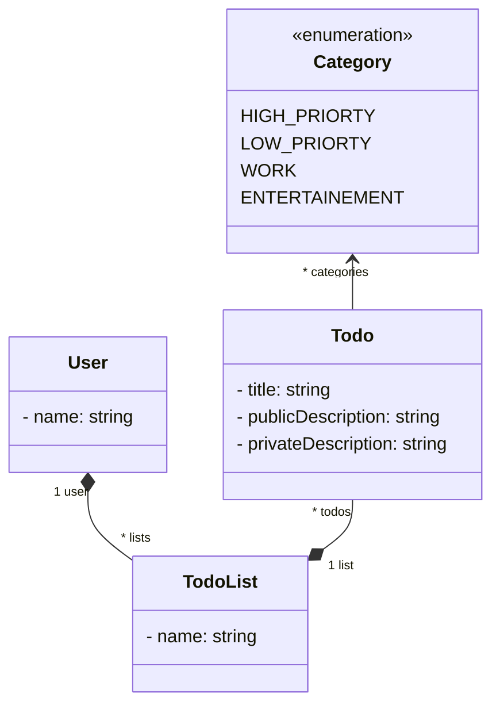

# Compétences visées

- Créer un back-end Java avec Spring

- Créer une API REST en Spring

- Marshaller et démarshaller des données de manière adéquate (DTO) 

- Tester une API REST de manières manuelle et automatique (JUnit, Postman, curl)

- Mettre en place une authentification

- Se prémunir de certaines attaques informatiques

- Écrire et traiter des requêtes REST en JavaScript


# Sujet

Opérations CRUD pour des todos.



# Préambule

- Les vrais sont sous Linux. En ce qui concerne les autres, vous pouvez toujours vous y mettre.

- Vérifier sa version de (Java 17) :
`java -version`

- Vérifier que Maven est installé (Maven 3) : `mvn -v`

- Télécharger Postman: https://www.postman.com/downloads/<br/>
Pas besoin de compte ni de licence.

- Avoir IntelliJ (vous pouvez utiliser VisualCode mais sans support de ma part)

- Cloner our télécharger le dépôt du cours : https://github.com/arnobl/WebEngineering-INSA/<br/>
L'exemple du cours se trouve dans : `rest/springboot2`<br/>
Le projet à utiliser pour le TP se trouve dans : `tp-spring`

- Avec IntelliJ, pour charger le projet du TP : `open` -> aller chercher le fichier `pom.xml` du projet -> *Open as project* -> *Trust Project*.


# Exercice 1


## Q1.1

- Créer les classes du diagramme de classes ci-dessus dans le package (à créer) `web.model`.
- Ajouter des getters/setters, `toString` en utilisant les annotations *lombok* sur les classes
```java
@Getter
@Setter
@ToString
```
Cf le cours vers la page 56 pour un exemple.

- À votre avis, comment fonctionne *lombok* d'après nos discussions en cours ?


## Q1.2

- Dans le package `web.controller` créer un contrôleur `TodoV1` REST avec l'URI `'api/insa/v1/todo'` (cf le cours).
- Y ajouter une route REST `GET` avec l'URI `'hello'` (cf cours). Cette méthode devra juste retourne une chaîne de caractères `'hello'` (attention au paramètre `produces` pour qu'il soit `MediaType.TEXT_PLAIN_VALUE`).

## Q1.3

- Lancer le programme et entrer la bonne URL dans un navigateur pour tester la route `hello`.
- Ouvrir la panneau de développement du navigateur pour observer le traffic réseau.
- Tester en ligne de commande avec curl
- Tester avec Postman

## Q1.4

- Créer une route REST `todo` (`GET`) qui retourna au format JSON une nouvelle instance (que l'on ne stockera pas) de la classe `Todo` (donner les valeurs que vous voulez). Pour info, créer une liste (non-mutable) avec juste un élément : `List.of(obj)`.
- Tester dans le navigateur
- Tester en ligne de commande avec curl
- Tester avec Postman (créer un nouvel onglet)

## Q1.5

- Créer une route REST `todo` (`POST`) qui recevra un objet `Todo` (en JSON, `consumes`) avec les données que vous voulez. Le type de retour de la route sera `void`.
- La route affichera pour l'instant juste cet objet
- Tester avec Curl (exemple vers page 51) et Postman (dans *body*, choisir *raw* au format *JSON* et écrire le JSON).


## Q1.6

- Ajouter un attribut `users` dans la classe de la ressource REST `TodoV1` dont le type sera une liste de `User`.

- Ajouter une route `POST` user pour créer un nouvel utilisateur en utilisant son nom uniquement. Nous considérons le nom d'un utilisateur comme clé unique : le `POST` doit vérifier qu'aucun utilisateur existant porte déjà ce nom. Ce nouvel utilisateur sera ajouter à la liste `users`.

- Tester avec Postman


## Q1.7

- Ajouter une route `PATCH user/{name}` qui modifiera un utilisateur. Pour cela l'URI de la route va avoir un paramètre pour identifier l'utilisateur à modifier : c'est le `{name}` (cf vers page 45 du cours). La requête doit également embarquée dans son body un `user` au format JSON (cf vers le slide 42).<br/>
Le patch permet de modifier les attributs d'un objet. Mais la classe `User` contient un attribut primitif (`name`) et une liste de `TodoList`. Est-ce que cela vous semble un bonne pratique de modifier au travers du patch les objets `TodoList` et leurs `Todo`, ou vaut-il mieux se limiter au attributs primitifs ?


- Tester avec Postman


### Q1.8

- Ajouter une route `DELETE user/{name}` qui supprimera l'utilisateur visé. Si celui-ci n'existe pas, ne rien faire.

- Tester avec Postman


## Plus tard

- Écrire un test JUnit qui testera la route `GET todo` (les données et le code HTTP retournés). Pour cela créer une classe de test `TestTodoV1` dans `src/test/java/web/controller`. Cf le cours pour comment tester avec Spring (vers la page 67). Il n'y a pour l'instant pas de service à pré-cabler (`@Autowired`), juste le classique `MockMvc`. Raccourci clavier pour importer une méthode statique (telle que `get()`) : curseur positionné sur la méthode -> `alt+entrée` -> *import static method* -> trouver la bonne méthode. Pour le `get` de Spring, le package à importer est :<br/>
 `import static org.springframework.test.web.servlet.request.MockMvcRequestBuilders.get;`

- Penser à bien tester la structure JSON retournée en utilisant le code donné dans le cours.

- La sécurité est cruciale dans une application Web. Le test que vous venez d'écrire peu encore être amélioré : imaginons que vous rajoutiez un nouvel attribut dans la classe `Todo`, hors ce nouvel attribut est une information sensible que vous ne voulez pas divulguer. Problème : votre test passe toujours malgré cet ajout. Une technique consiste à vérifier le nombre d'attributs dans la structure retournée :<br/>
`.andExpect(jsonPath("$.*", hasSize(4)))`<br/>
Ainsi, lors de l'ajout d'un nouvel attribut, le test ne passera plus et il faudra soit le mettre à jour, soit modifier le code de Todo pour qu'il ne marshalle pas cet attribut. On verra plus tard que l'autre solution plus propre consiste à utiliser des DTO.


## Plus tard
- Tester (JUnit) que l'ajout (`POST todo`) ne crash pas : que le code de retour est bien `OK` (exemple vers page 73). Noter qu'en Java 17 vous pouvez écrire un *text block* :
```java
    .content("""
{
    "title": "title2",
    "privateDescription": "foo",
    "publicDescription": "bar,
    "categories": ["ENTERTAINEMENT"]
}
	"""))
```
Un block de triple quote `""" """` permet de mettre ce que l'on veut à l'intérieur (en l'occurrence des quotes). Le formatage est également respecté.


- De manière générale, comment tester qu'un ajout a bien fonctionné (on le fera plus tard) ?