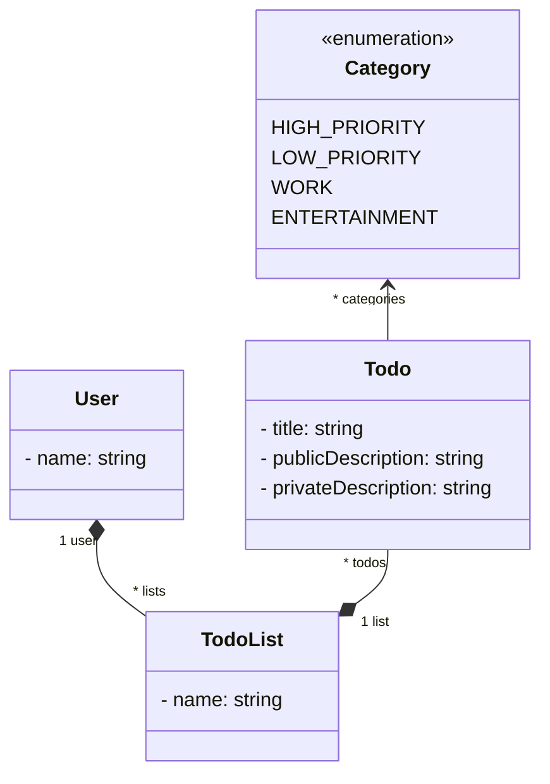

# Préambule

Le sujet est tout neuf et contient certainement des erreurs. N'hésitez pas à me les indiquer. Également, faites le sujet à votre vitesse : ce sujet fera l'objet de plusieurs séances de TP (voire toutes) ; les séances de TP ne sont pas associées à des séries de questions. 

N'hésitez pas à nous demander des explications sur des concepts Java/POO que vous ne comprenez pas.


# Compétences visées

- Créer un back-end Java avec Spring

- Créer une API REST en Spring

- Marshaller et démarshaller des données de manière adéquate (DTO) 

- Tester une API REST de manière manuelle et automatique (JUnit, Postman, curl)

- Mettre en place une authentification

- Se prémunir de certaines attaques informatiques

- Écrire et traiter des requêtes REST en JavaScript


# Sujet

Le sujet des TP concerne la création d'un back-end pour réaliser des opérations CRUD pour des todos.



Par simplification du problème, nous considérerons le nom d'un utilisateur comme clé unique. De même, le nom d'une todo list sera unique par utilisateur. Le titre d'un todo sera unique par todo list.


# Prérequis logiciels

- Les vrais sont sous Linux. En ce qui concerne les autres, vous pouvez toujours vous y mettre.

- Vérifier sa version de (Java 17) :
`java -version`

- Vérifier que Maven est installé (Maven 3) : `mvn -v`

- Télécharger Postman: https://www.postman.com/downloads/<br/>
Pas besoin de compte ni de licence.

- Avoir IntelliJ (vous pouvez utiliser VisualCode mais sans support de ma part)

- Cloner our télécharger le dépôt du cours : https://github.com/arnobl/WebEngineering-INSA/<br/>
L'exemple du cours se trouve dans : `rest/springboot2`<br/>
Le projet à utiliser pour le TP se trouve dans : `tp-spring`

- Avec IntelliJ, pour charger le projet du TP : `open` → aller chercher le fichier `pom.xml` du projet → *Open as project* → *Trust Project*.


# Exercice 1


## Q1.1

- Créer les classes du diagramme de classes ci-dessus dans le package (à créer) `web.model`.
- Ajouter des getters/setters, `toString` en utilisant les annotations *lombok* sur les classes
```java
@Getter
@Setter
@ToString
```
Cf. le cours vers la page 56 pour un exemple.

- À votre avis, comment fonctionne *lombok* d'après nos discussions en cours ?


## Q1.2

- Dans le package `web.controller` créer un contrôleur `TodoV1` REST avec l'URI `'api/insa/v1/todo'` (Cf. le cours).
- Y ajouter une route REST `GET` avec l'URI `'hello'` (Cf. cours). Cette méthode devra juste retourne une chaîne de caractères `'hello'` (attention au paramètre `produces` pour qu'il soit `MediaType.TEXT_PLAIN_VALUE`).

## Q1.3

- Lancer le programme et entrer la bonne URL dans un navigateur pour tester la route `hello`.
- Ouvrir le panneau de développement du navigateur pour observer le traffic réseau.
- Tester en ligne de commande avec curl
- Tester avec Postman

## Q1.4

- Créer une route REST `todo` (`GET`) qui retourna au format JSON une nouvelle instance (que l'on ne stockera pas) de la classe `Todo` (donner les valeurs que vous voulez).
- Tester dans le navigateur
- Tester en ligne de commande avec curl
- Tester avec Postman (créer un nouvel onglet)

## Q1.5

- Créer une route REST `todo` (`POST`) qui recevra un objet `Todo` (en JSON, `consumes`) avec les données que vous voulez. Le type de retour de la route sera `void`.
- La route affichera pour l'instant juste cet objet (`System.out.println(...)`).
**Attention :** la sortie de `println` sera visible dans la console d'IntelliJ (et non dans Postman). 
- Tester avec Curl (exemple vers page 51) et Postman (dans *body*, choisir *raw* au format *JSON* et écrire le JSON).


## Q1.6

- Ajouter un attribut `users` dans la classe de la ressource REST `TodoV1` dont le type sera une liste de `User`. 
Cet attribut sera instancié dans le contructeur (à créer) du contrôleur.

- Ajouter une route `POST user` pour créer un nouvel utilisateur en utilisant son nom uniquement. Nous considérons le nom d'un utilisateur comme clé unique : le `POST` doit vérifier qu'aucun utilisateur existant porte déjà ce nom. Ce nouvel utilisateur sera ajouter à la liste `users`.

- Tester avec Postman


## Q1.7

- Ajouter une route `PATCH user/{name}` qui modifiera un utilisateur. Pour cela l'URI de la route va avoir un paramètre pour identifier l'utilisateur à modifier : c'est le `{name}` (Cf. vers page 45 du cours). La requête doit également embarquer dans son body un `user` au format JSON (Cf. vers le slide 42).<br/>
Le patch permet de modifier les attributs d'un objet. Mais la classe `User` contient un attribut primitif (`name`) et une liste de `TodoList`. Est-ce que cela vous semble une bonne pratique de modifier au travers du patch les objets `TodoList` et leurs `Todo`, ou vaut-il mieux se limiter aux attributs primitifs ?


- Tester avec Postman


## Q1.8

- Ajouter une route `DELETE user/{name}` qui supprimera l'utilisateur visé. Si celui-ci n'existe pas, ne rien faire.

- Tester avec Postman


## Q1.9

- Ajouter une requête `POST todolist/{userName}`. Cette requête doit avoir un paramètre `userName` correspondant au nom de l'utilisateur à qui il faut ajouter la todo list (embarquée dans le body de la requête).<br/>
Cela vous demandera de coder une méthode `findUser(String userName)` dans le contrôleur pour chercher un utilisateur dans la liste `users` en fonction d'un nom. Cette méthode retournera `null` si aucun utilisateur ne correspond au nom. 

- Tester avec Postman


## Q1.10


- Modifier la requête `POST todo` pour que son URI soit désormais `todo/{userName}/{todolistName}`.
En effet, l'ajout d'un todo requière le nom de la todo list ainsi que le nom de l'utilisateur.
Modifier le code de cette requête pour qu'elle ajoute le todo envoyé dans la todo list de destination (ne rien faire si pas possible).<br/>
Cela vous demandera de coder :
une méthode `findTodoList(String todolistName)` dans la classe `User`, pour toruver la todo list visée ; 
une méthode `findTodo(String todoTitle)` dans la classe `TodoList`, pour trouver le todo visé dans la todo list ; 
une méthode `findTodo(String userName, String todolistName, String todoName)` dans le contrôleur, pour trouver le todo visé.


- Tester avec Postman

# Exercice 2


## Q2.1

- Créer une classe de tests `TestTodoList` (dans `src/test/java/web/model`) pour y tester la méthode `findTodo`.

- Créer une classe de tests `TestUser` (dans `src/test/java/web/model`) pour y tester la méthode `findTodoList`.


## Q2.2

- Écrire un test JUnit qui testera la route `GET todo` (les données et le code HTTP retournés). Pour cela créer une classe de test `TestTodoV1` dans `src/test/java/web/controller`. Cf. le cours pour comment tester avec Spring (vers la page 67). Il n'y a pour l'instant pas de service à pré-câbler (`@Autowired`), juste le classique `MockMvc`. Raccourci clavier pour importer une méthode statique (telle que `get()`) : curseur positionné sur la méthode → `alt+entrée` → *import static method* → trouver la bonne méthode. Pour le `get` de Spring, le package à importer est :<br/>
 `import static org.springframework.test.web.servlet.request.MockMvcRequestBuilders.get;`

- Penser à bien tester la structure JSON retournée en utilisant le code donné dans le cours.

- La sécurité est cruciale dans une application Web. Le test que vous venez d'écrire peu encore être amélioré : imaginons que vous rajoutiez un nouvel attribut dans la classe `Todo`, hors ce nouvel attribut est une information sensible que vous ne voulez pas divulguer. Problème : votre test passe toujours malgré cet ajout. Une technique consiste à vérifier le nombre d'attributs dans la structure retournée :<br/>
`.andExpect(jsonPath("$.*", hasSize(4)))`<br/>
Ainsi, lors de l'ajout d'un nouvel attribut, le test ne passera plus et il faudra soit le mettre à jour, soit modifier le code de Todo pour qu'il ne marshalle pas cet attribut. On verra plus tard que l'autre solution plus propre consiste à utiliser des DTO.


## Q2.3

- Tester (JUnit) que l'ajout (`POST todo`) ne crash pas : que le code de retour est bien `OK` (exemple vers page 73). Noter qu'en Java 17 vous pouvez écrire un *text block* :
```java
    .content("""
{
    "title": "title2",
    "privateDescription": "foo",
    "publicDescription": "bar",
    "categories": ["ENTERTAINMENT"]
}
	"""))
```
Un block de triple quote `""" """` permet de mettre ce que l'on veut à l'intérieur (en l'occurrence des quotes). Le formatage est également respecté.


- De manière générale, comment tester qu'un ajout a bien fonctionné (on le fera plus tard) ?


# Exercice 3

Vous avez réalisé une version *v1* de l'API REST (avec peu de tests unitaires, mais on fera mieux par la suite).

Cette *v1* souffre d'un défaut majeur : toutes les données sont contenues dans les contrôleurs REST de Spring (les attributs de la classe `TodoV1`). Le but de cet exercice est de réaliser une *v2* qui résoudra ce problème.

## Q3.1

- Pourquoi contenir les données dans les contrôleurs REST est une très mauvaise pratique ?


## Q3.2

- Créer un nouveau contrôleur REST Spring `TodoV2` avec l'URI `'api/insa/v2/todo'` (Cf. le cours). Y copier-coller le contenu de `TodoV1`.

## Q3.3

- Créer un service `TodoService` (cf. à partir de la page 64 dans le cours). 


- Y mettre les données (la liste de `user`) utilisées par `TodoV2` **ainsi que les méthodes `findUser` et `findTodo`**. 

- `TodoV2` devra avoir un attribut du type de ce service et qui sera instancier, pour l'instant, dans le constructeur du contrôleur. Les routes devront alors passer par ce service pour accéder aux données et aux méthodes `findUser` et `findTodo`.


## Q3.4

En fait, c'est également une très mauvaise pratique d'instancier un service directement dans un contrôleur. Un service est un objet créé et géré par le serveur (l'application Spring) et fourni aux différents contrôleurs qui le demandent. C'est le principe de l'injection de dépendances que nous verrons en 4INFO. Le but est de pouvoir partager un même service au travers de différents contrôleurs.

- Faire comme dans le slide 67 : le service est un paramètre du constructeur du contrôleur et non instancié dans celui-ci.

- Pour rappel, qui instancie les contrôleurs et les services, etc. ?


## Q3.5

- Créer une classe de tests `TestTodoV2` et y copier-coller le contenu de `TestTodoV1`. Modifier ensuite la classe de tests pour y ajouter un attribut :
```java
@Autowired
private TodoService todoService;
```

- Compléter vos tests existants pour utiliser ce service afin de vérifier que les requêtes REST ont bien un effet sur les données


## Q3.6

- À ce niveau vous devriez avoir des opérations CRUD pour `User`, `TodoList` et `Todo`.
Si ça n'est pas le cas, compléter votre API REST.
Votre suite de tests doit tester votre API REST avec au moins un test par route REST.


# Exercice 4

Vive le marshalling et l'héritage.
Dans cet exercice, vous allez comprendre comment marshaller des types abstraits, ce qui ne se fait pas naturellement avec Spring (et autres).
Le but est de mieux comprendre le marshalling en Java et la magie qui opère grâce à Spring.


# Q4.1

- Ajouter une classe `SpecificTodo` qui hérite de la classe `Todo`.
Cette nouvelle classe a un attribut `String mySpecificAttr`.

# 4.2

- tester votre route REST `POST todo` en envoyant une instance de `SpecificTodo`.
Que ce passe côté serveur ? Quelle est le type de l'objet marshallé par la route ?


# 4.3

- Ajouter les annotations nécessaires sur `Todo` pour que le marshalling fonctionne correctement avec l'héritage (cf. le cours)

- Tester avec Postman

- Écrire un test unitaire qui poste un `SpecificTodo`.


# Exercice 5

Vous avez réalisé une version *v2* de l'API REST.
En fait cette *v2* n'est pas très réaliste : elle permet d'appliquer des opérations CRUD sur le modèle.
Dans la vraie vie, une API REST doit plus être orientée métier que CRUD : 
imaginons que nous fabriquions une véritable application pour Todo,
Cette application aurait des fonctionnalités, telles qu'afficher le nom des todo lists, recherche des todos.
Quelles seraient les différentes routes REST idéales pour ces usages (question rhétorique, cf 5.1) ?
La conception d'une API REST doit plutôt se faire en pensant à l'usage :
comment faciliter la fabrication d'un front-end en fournissant une API REST dédiée


# 5.1

- Proposer une API REST, orientée métier, composée de six routes REST pour afficher (2 routes), rechercher (2 routes), éditer (2 routes)
les todos d'un utilisateur.


# 5.2

- Proposer les structures de données idéales pour ces six requêtes.
Le but est de réduire au minimum les données envoyées ou reçues par les routes.
Par exemple, un utilisateur peut vouloir la liste de ses todolist, auquel cas la requête REST correspondante 
a juste besoin de retourner la liste des noms (et non les objets todolist dans leur intégralité).
Ces structures de données seront nos DTO.


# 5.3

- Créer des classes (ou des `record` Java) pour chacune des structures de données idéales

# 5.4

- Coder un nouveau contrôleur REST qui implémente votre nouvelle API REST en utilisant ces DTO.

- Tester avec Postman (avec Junit si vous êtes en avance).


