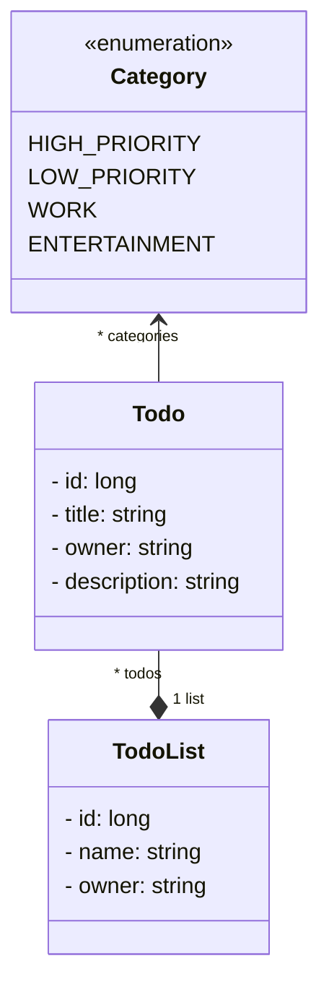

# Préambule

N'hésitez pas à nous indiquer les éventuelles erreurs du sujet. 

**Vous devez terminer le TP précédent avant chaque nouvelle séance**.

N'hésitez pas à nous demander des explications sur des concepts Java/POO que vous ne comprenez pas.


# Compétences visées

- Créer un back-end Java avec Spring

- Créer une API REST en Spring

- Marshaller et démarshaller des données de manière adéquate (DTO)

- Tester une API REST de manière manuelle et automatique (JUnit)

- Mettre en place une authentification

- Se prémunir de certaines attaques informatiques

- Écrire et traiter des requêtes REST en JavaScript


# Sujet

Le sujet des TP concerne la création d'un back-end pour réaliser des opérations CRUD pour des todos.



Les attributs `id` sont les identifiants uniques des objets.


# Prérequis logiciels

- Les vrais sont sous Linux. En ce qui concerne les autres, vous pouvez toujours vous y mettre.

- Vérifier sa version de (Java 21) :
`java -version`

- Vérifier que Maven est installé (Maven 3) : `mvn -v`

- Utiliser l'instance de *Swagger Editor* en ligne : https://editor-next.swagger.io/<br/>
Il faudra penser à sauvegarder le modèle OpenAPI à la fin de chaque séance.

- Avoir IntelliJ (ou VisualCode, mais une préférence pour IntelliJ)<br/>

- Si vous utilisez IntelliJ, installez le plugin Lombok<br/>

- Utilisez un vrai navigateur Web (Firefox, Chrome, Chromium), et pas Brave, Safari, Edge

- Cloner le dépôt du cours :
`git clone https://github.com/arnobl/WebEngineering-INSA.git`

Cloner permet de mettre à jour votre version du dépôt en cas de changements de notre part :
`git fetch`
`git merge`

L'exemple du cours se trouve dans : `rest/springboot2`<br/>

**Le projet à utiliser pour le TP se trouve dans : `tp-spring`**

- Avec IntelliJ, pour charger le projet du TP : `open` → aller chercher le fichier `pom.xml` du projet → *Open as project* → *Trust Project*. <br/>
Avec VSCode, faites *Ouvrir un dossier*.


# TP 1

**Pensez à la fin du TP à sauvegarder votre modèle OpenAPI de Swagger Editor !**

## Q1.1

Lancer le back-end en allant dans `TpSpringApplication.java` et en lançant le `main`.
Vous pouvez aussi démarrer l'application en exécutant la commande suivante (dans le même dossier que le `pom.xml`) :
`mvn spring-boot:run`


- Dans Swagger Editor (https://editor-next.swagger.io), supprimez le contenu affiché et ajoutez simplement :
```yaml
openapi: 3.1.0
info:
  title: TP Web INSA Rennes
  description: |-
    Intro au dev d'un back-end REST en Java avec Spring et OpenAPI
  version: 2024.0.0
servers:
  - url: "http://localhost:8080/api"

tags: # Some annotations used to document the route descriptions (optional)
  - name: hello
    description: Démo
paths:
    /v1/public/hello/helloworld:
        get:
            tags:
                - hello
            responses:
              '200':
                description: c'est bon
```

- Exécutez cette commande REST avec `Try it out` -> `Execute`.

- Cette route est déjà codée dans le contrôleur REST `HelloController` (package `tpspring.controller`). Regardez cette classe.

## Q1.2

- Dans votre navigateur, entrez l'URL `http://localhost:8080/api/v1/public/hello/helloworld`<br/>
Pourquoi la barre d'adresse de votre navigateur sait-elle gérer une requête REST GET ? Est-elle aussi capable de gérer un POST ?


- Affichez la console de développement de votre navigateur. Allez dans l'onglet réseau et rafraîchissez la page. Vous devriez pouvoir observer la requête et ses détails.


## Q1.3 Get OpenAPI

- Dans votre Swagger Editor, ajoutez une route REST `/v1/public/todo/todo/{id}` (`GET`) qui retourna au format JSON une instance de la classe `Todo`.
Le tag de cette route sera (tag `todo`). Cette route aura un paramètre `id` du type *integer*. Inspirez-vous de l'exemple OpenAPI du cours : https://github.com/arnobl/WebEngineering-INSA/blob/master/rest/openapi.yaml (copier-coller-adapter, cf ligne 18, attention à l'indentation qui peut être très pénible).
Notamment, vous aurez besoin de définir et d'utiliser le schéma de l'objet retourné (le `Todo`). En grand prince je vous le donne pour cette fois :
```yaml
components:
  schemas:
    Todo:
      type: object
      properties:
        id:
          type: integer
          format: int64
          examples: [10, 1]
        title:
          type: string
          examples: ["mon todo"]
        description:
          type: string
          examples: ["je dois terminer mon TP de Web pour le prochain TP"]
        categories:
          type: array
          items:
            type: string
            examples: ["WORK"]
```
Avec Swagger, testez que la commande ne fonctionne pas.

## Q1.4 Get v1

- Créez un nouveau contrôleur REST `TodoControllerV1` dans le package `controller`.
- Ajoutez un attribut dans ce contrôleur correspondant à une table d'objets `TODO` (à initialiser dans le constructeur avec deux objets `Todo` ayant pour `id` 1 et 2 et le titre que vous voulez, attention en Java un long s'écrit `1L`):
```java
private final Map<Long, Todo> todos;
```
- Codez cette requête dans ce contrôleur (il faudra redémarrer le back-end, et n'oubliez pas `@PathVariable`). L'instance retournée sera celle ayant l'ID correspondant au paramètre `id`. Si l'id fourni ne correspond à aucun TODO retournez pour l'instant `null`.
- Tester à nouveau dans Swagger Editor. Vous pouvez voir que le format du JSON reçu ne correspond pas à celui attendu (celui défini dans Swagger Editor). Nous verrons cela plus tard avec les DTO.
- Tester dans le navigateur avec 1, 2 et 3 comme ID.
- Pourquoi une `Map` plutôt qu'une `List` ? Pourquoi un `Long` plutôt qu'un `Integer` ?

## Q1.5 Post v1

- Créez une route REST `POST` `/v1/public/todo/todo` (**NE METTEZ JAMAIS DE / À LA FIN DE URI DANS SWAGGER**) (dans Swagger Editor puis dans votre projet Spring) qui recevra un objet `Todo` (en JSON, `consumes`) avec les données que vous voulez (ignorez l'unicité des ID pour l'instant). Le type de retour de la route sera `void` (code 200 donc).
- La route affichera pour l'instant juste cet objet (`System.out.println(...)`) et l'ajoutera à la table de hachage (pas grave si la clé existe déjà).
**Attention :** la sortie de `println` sera visible dans la console d'IntelliJ (et non dans votre navigateur).
- Tester avec Swagger Editor


## Terminez le TP pour la séance d'après

**Et sauvegarder votre modèle OpenAPI de Swagger Editor !**


# TP 2

**Pensez à la fin du TP à sauvegarder votre votre modèle OpenAPI de Swagger Editor !**

## Q2.1 Post v2

Dans les questions précédentes, nous ne gérions pas l'identifiant unique des `Todo`.

- Dans le contrôleur REST, ajoutez un attribut `cpt` (type `long`) qui sera incrémenté à chaque nouveau todo et utilisé comme identifiant du nouveau todo. Modifiez la route `POST` en conséquence et commentez les deux ajouts de `Todo` dans le constructeur. Cette pratique n'est pas propre du tout. Nous verrons plus tard comment faire cela de manière correcte.

- Cette route retournera maintenant l'objet `Todo` créé. Modifiez le Swagger Editor en conséquence. Modifiez le `println` pour qu'il affiche la liste des todos.


## Q2.2 Delete

- Ajoutez (dans Swagger Editor et votre code Spring) une route `DELETE` `/v1/public/todo/todo/{id}` qui supprimera le todo dont l'id est celui donné en paramètre de l'URI. Cette route devra alors chercher dans la structure le todo dont l'id est égal à celui du todo passé en paramètre. Si la recherche échoue, alors retourner un code `400` (cf l'exemple *openapi.yaml*). Si elle réussit, vous supprimerez l'objet de la liste des todos.

- Testez avec Swagger Editor.


## Q2.3 Get v2

- À l'instar du `delete` de la question précédente, améliorez le `get` développé lors du TP 1 (meilleure gestion d'un mauvais id fourni).

- Testez avec Swagger Editor.


## Q2.4 Put

- Le `Put` remplace un objet par un autre. C'est une manière de modifier complètement un objet.
Ajoutez une route (dans Swagger Editor et votre code Spring) `PUT` `/v1/public/todo/todo` qui fera cette opération sur un todo. Pour cela vous pouvez copier-coller-adapter la route `POST` car assez proche.
Si l'objet n'existe pas (si l'ID donné ne correspond pas à un objet existant), alors une réponse avec un code `BAD_REQUEST` (code 400) sera retournée.

- Testez avec Swagger Editor.


## Q2.5 Patch pas terrible

- Ajoutez une route `PATCH` `todo` qui modifiera un todo. Pour cela copier-coller-modifier la route `POST` `todo` car cette première version du patch est assez similaire. Cette route devra alors chercher dans la liste le todo dont l'id est égal à celui du todo passé en paramètre. Si la recherche échoue, alors retourner un code `400` (cf. l'exemple *openapi.yaml*). Si elle réussit, alors vous utiliserez les setters de `Todo`, par exemple :
```java
  if(todo.getPublicDescription() != null) {
    todoFound.setPublicDescription(todo.getPublicDescription());
  }
  //etc.
```

Cette manière de faire le patch souffre de plusieurs défauts importants. Lesquels selon vous ?
Lecture intéressante : https://stackoverflow.com/a/19111046/9649530


## Bilan TP2

Nous avons vu les bases pour coder des routes REST réalisant des opérations CRUD sur un type d'objets (le `Todo`).

Pour l'instant le code de notre back-end a plusieurs défauts majeurs :
- Stockage des objets dans le contrôleur. Ça n'est pas une bonne pratique car comment partager les données entre plusieurs contrôleurs ? Et est-ce le rôle d'un contrôleur de stocker ? Nous utiliserons plus tard un *service*.
- Gestion à la main de l'unicité des objets ainsi qu'un stockage peu efficaces des données. Nous utiliserons une base de données et son lien avec le back-end (JPA) plus tard.
- Nous (de-)marshallons directement les objets `Todo` alors que nous voulons que quelques attributs dans certains cas. Nous utiliserons des DTO plus tard.
- Pas de tests unitaires (TU) écrits pour l'instant.
- Pas de sécurité : tout le monde pour faire du CRUD sur les objets todo.


## Terminer le TP pour la séance d'après

**Et sauvegarder votre openAPI de Swagger Editor !**


# TP 3

## Q3.1 contrôleur V2

- Copiez-collez le contrôleur `TodoControllerV1.java` pour avoir un `TodoControllerV2.java` dont le `RequestMapping` indique `api/v2/public/todo`.
Dans Swagger, les routes créées aux TP précédents étaient destinées à la `v1`. Pour interagir avec la `v2` vous devrez copier-coller-adapter les routes de `v1` en fonction des besoins du contrôleur `v2`. Mettez en commentaire toutes les routes de ce nouveau contrôleur.


## Q3.2 Service

- Dans un package `tpspring/service`, créez un service `TodoServiceV1` (cf. les slides du cours, n'oubliez pas l'annotation `@service` sur la classe d'un service) et ajoutez un attribut de ce type dans votre nouveau contrôleur avec `@Autowired`. Que fait cette annotation ?

- Déplacez les attributs `cpt` et `todos` dans ce service. Cela va vous demander de modifier la plupart des routes de votre contrôleur pour déléguer au service toute la logique CRUD des opérations.
Votre service devrait donc avoir les méthodes suivantes :
```java
	public Todo addTodo(final Todo todo) {
	}
  // true if newTodo corresponds to an existing todo
	public boolean replaceTodo(final Todo newTodo) {
	}
// true if id corresponds to an existing todo
	public boolean removeTodo(final long id) {
	}

	public Todo modifyTodo(final Todo partialTodo) {
	}

	public Todo findTodo(final long id) {
  }
```

- Que se passe-t-il si je mets un attribut `@autowired TodoServiceV1...` dans un autre contrôleur ?


Quels sont les avantages d'un service par rapport à nos 2 TP précédents ?
Nous creuserons en 4INFO ce concept d'injection de dépendances (le `@autowired`).


## Q3.4 Contrôleur V2 + service V1

- Décommettez et adaptez au fur et à mesure les méthodes du `TodoControllerV2` pour utiliser `TodoServiceV1`.


## Q3.4 Repository

Codez un service comme nous l'avons fait dans la question précédente est un peu laborieux (gestion à la main du `cpt`, structure de stockage) : les opérations CRUD sur un objet, c'est du grand classique et Spring fournit un mécanisme pour simplifier cela : les `repository`.
Les `repository` sont injectables tout comme les services. La différence est que ces premiers ont pour but de stocker des données et faciliter leur accès. Les services offrent des méthodes pour réaliser des opérations, des calculs.

- Dans le package `tpspring.service` créez un repository CRUD pour les todo :

```java
@Repository
public interface TodoCrudRepository extends CrudRepository<Todo, Long> {
}
```
Pour rappel, le générique `Long` correspond au type de la clé primaire de `Todo` (l'attribut `id`).

- Dupliquez le fichier `TodoServiceV1.java` et renommez la copie en `TodoServiceV2` Dans `TodoServiceV2`, mettez en commentaire les attributs `cpt` et `todos` et ajoutez à la place votre nouveau repository :
```java
@Autowired
private TodoCrudRepository repository;
```

- Attention, si dans les questions suivantes vous voulez utiliser un objet injecté dans le constructeur de votre service, vous obtiendrez un `NullPointerException`, car l'injection se fait après la création.
Dans ce cas, il vous faudra supprimer l'annotation `@Autowired`, et ajouter un paramètre au constructeur :
```java
public TodoService(TodoRepository repo) {
   this.todoRepo = repo;
   // Initialisation
}
```

- Modifiez le code du service `TodoServiceV2` pour qu'il utilise désormais le repository pour stocker les objets `todo`. Vous noterez que la méthode `save` du repository ne demande pas l'id unique de l'objet. Pourquoi ? (il manque quelque chose dans la classe `Todo` que nous allons ajouter). Attention, pour `findTodo` vous devrez utilisez la méthode `findById` du repository qui retourne un `Optional<Todo>` et non un `Todo`. Changez le type de retour des différentes méthodes du service en conséquence. Un `Optional` est une boite pouvant contenir ou non un objet (`isPresent`, `isAbsent`, `get`).

- Remplacez `TodoServiceV1` par `TodoServiceV2` dans votre `TodoControllerV2` et adaptez pour que le code compile.

- Si vous lancez le serveur, ce dernier devrait planter.
Ajoutez les annotations nécessaires dans la classe `Todo` pour pallier le problème : il manque quelque chose dans la classe `Todo` car Spring a besoin d'identifier la clé unique d'un objet `Todo` (cf. JPA).

- Testez votre nouveau contrôleur avec Swagger Editor.


## Bilan TP3

Nous avons vu comment mieux gérer les données manipulées dans un back-end à l'aide des services et des repositories.


Cependant, le notre back-end a encore des défauts :
- Nous utilisons un repository CRUD et non une véritable base de données, ce qui nous empêche d'écrire des requêtes SQL.
- Nous (de-)marshallons directement les objets `Todo` alors que nous voulons que quelques attributs dans certains cas. Nous utiliserons des DTO plus tard.
- Pas de test unitaire (TU) écrit pour l'instant.
- Pas de sécurité : tout le monde pour faire du CRUD sur les objets todo.


## Terminer le TP pour la séance d'après

**Et sauvegarder votre openAPI de Swagger Editor !**


# TP 4

## Q4.1 Retour des routes REST

Étant donné le code ci-dessous, qu'est-ce qui est retourné au client qui a envoyé la requête REST ? Un objet `Todo` ?

```java
@GetMapping(path = "todo", produces = MediaType.APPLICATION_JSON_VALUE)
public Todo todo() {
  return new Todo(1, "A title", "desc", List.of(Category.ENTERTAINMENT, Category.WORK), "foo");
}
```

Et maintenant avec cette méthode qui retourne `void` ?

```java
@DeleteMapping(path = "todo/{id}")
public void deleteTodo(@PathVariable("id") final long id) {
  if(!todoListService.removeTodo(id)) {
    throw new ResponseStatusException(HttpStatus.BAD_REQUEST, "Not possible");
  }
}
```

## Q4.2

Du coup, quelle différence avec le code suivant ? Que permet le code suivant ?


```java
@PutMapping(path = "user", consumes = MediaType.APPLICATION_JSON_VALUE)
public ResponseEntity<String> replaceUser(@RequestBody final User patchedUser) {
  if(patchedUser.getId().equals(dataService.getUser().getId())) {
    dataService.setUser(patchedUser);
    return ResponseEntity.ok().build();
  }
  throw new ResponseStatusException(HttpStatus.BAD_REQUEST, "The ID is not the same");
}
```


## Q4.3 Les exceptions

Toujours avec le code suivant, qu'est-ce qui est retourné au client lorsqu'une exception est levée ?

```java
@DeleteMapping(path = "todo/{id}")
public void deleteTodo(@PathVariable("id") final long id) {
  if(!todoListService.removeTodo(id)) {
    throw new ResponseStatusException(HttpStatus.BAD_REQUEST, "Not possible");
  }
}
```

## Q4.4 Marshalling avec héritage

La classe `SpecificTodo` est une sous-classe de `Todo`.
Dans `TodoControllerV2`, modifiez temporairement la route `GET` `todo/todo/{id}` pour qu'elle retourne un objet `SpecificTodo`: commentez temporairement le contenu de cette méthode pour qu'elle retourne un `SpecificTodo` (`return new SpecificTodo(...);`). Relancez le serveur et testez cette route. Utilisez le résultat retourné pour l'envoyer via la route `POST`. Pourquoi cette dernière ne crée-t-elle finalement pas un `SpecificTodo` mais un `Todo` ?

Ajoutez les annotations nécessaires pour que cela fonctionne. Cf vers le slide 47. Il vous faudra aussi ajouter l'annotation `@Entity`.
Testez et pensez à remettre comme avant la route `GET`.


## Q4.5

Créez un nouveau contrôleur (URI `api/v2/public/todolist`), un nouveau service et un nouveau repository pour les `TodoList`.


## Q4.6

Ajoutez dans Swagger Editor et dans votre nouveau contrôleur les routes REST suivantes :
- une route pour ajouter une `TodoList` vide. Une `TodoList` vide ne contient pas de `Todo` **mais possède un nom et une description**. Vous devrez ajouter des annotations à `TodoList` à l'instar de `Todo`. Vous devrez également ajouter des annotations JPA pour identifier les clés étrangères de `TodoList` et `Todo` : puisque `TodoList` a une liste de `Todo`, dans la base de données il faut expliciter comment cette référence Java va se transformer en schéma relationnel. Regardez les annotations `@OneToMany` et `@ManyToOne` vers le slide 76. Sans ces annotations, le back-end crashera et vous expliquant qu'il ne sait pas gérer dans la base de données la relation entre ces deux classes.


## Terminer le TP pour la séance d'après

**Et sauvegarder votre openAPI de Swagger Editor !**


# TP 5

## 5.1 DTO

La route pour ajouter un objet `Todolist` vide n'est pas optimale : pourquoi envoyer un objet `TodoList` alors que nous n'avons besoin que de son nom et de sa description ?
Plusieurs solutions : mettre le nom dans l'URI de la requête ou embarquer un DTO contenant uniquement le nom dans le body de la requête. Nous allons utiliser cette dernière solution.

- À la place d'un objet `TodoList`, utilisez le record `NamedDTO` (package `tpspring/controller/dto`) contenant : un attribut correspondant à un nom ; un attribut pour la description. Un record est une classe Java dans laquelle sont déclarées les attributs et sont automatiquement générés un constructeur et les getters/setters.


- Ajoutez ce DTO dans la définition de votre Swagger Editor (c'est une structure avec un attribut) et modifiez la route concernée. Testez.

- Les DTO ne devraient pas être utilisés en dehors des contrôleurs REST car il s'agit d'objets de transfert de données. À l'avenir, assurez-vous de ne pas utiliser les DTO dans les services par exemple.


## 5.2

- Ajoutez une route pour ajouter un todo à une todo list (un todo pour être dans plusieurs lists pour l'instant). Attention, vous aurez donc besoin de l'id du todo à ajouter et de l'id de la todo list concernée. Donc votre `TodoListService` aura les deux repositories.
Attention, une boucle infinie va survenir : un `Todo` à un attribut `TodoList`, et un `TodoList` contient des objets `Todo`.
Il faut donc casser cette boucle. Pour cela, dans `Todo`, annoter l'attribut `list` avec `@JsonIgnore`.


## 5.3 Patch Todo

Nous allons modifier la requête `patch` `todo/todo` pour la rendre de meilleure qualité.
- Inspirez-vous du slide 31 (ou slides autour) pour modifier la requête et le service pour patch correctement le todo.
- Modifiez le Swagger Editor et testez


## 5.4 Query

- Ajoutez une query dans le repository des `Todo` pour retourner la liste des `Todo` dont le titre contient le texte donné en paramètre (cf la partie `Query` dans le cours).

- Ajoutez la requête REST associée dans le contrôleur Todo v2 et testez avec Swagger Editor


# TP 6 -- Test

Le sujet de ce TP est simple.
Développez une suite de tests qui teste la dernière version de votre contrôleur, votre service, et repository avec une couverture de branche de 100%.
En test unitaire (TU) nous testons chaque classe séparément, donc le service puis le contrôleur (le repository n'a pas de code étant géré par Spring).

- Complétez la classe de tests `TestTodoServiceV2`. Nous fournissons un premier test pour vous aider. Cette suite de tests requiert l'utilisation de *mocks* (cf. CPOO1).

- Complétez la classe de tests `TestTodoControllerV2`. Nous fournissons également des tests pour vous aider. L'utilisation de mocks est également nécessaire pour gérer des objets dans le service.


# TP 7 -- Page Web + requêtes basiques

Le but de ce TP est de comprendre comment un page Web fonctionne dans un navigateur.
Pour ce TP, lancez le back et ouvrez, dans votre navigateur et dans IntelliJ, le fichier `index.html` se trouvant dans le dossier `tp7`.
La documentation Mozilla est indispensable pour comprendre les concepts de base.
Par exemples (à consulter durant le TP) :

https://developer.mozilla.org/fr/docs/Glossary/DOM
https://developer.mozilla.org/fr/docs/Web/HTML/Element/body
https://developer.mozilla.org/en-US/docs/Web/API/Document
https://developer.mozilla.org/fr/docs/Web/API/Document/getElementById
https://developer.mozilla.org/fr/docs/Web/JavaScript/Reference/Global_Objects/JSON/parse
https://developer.mozilla.org/fr/docs/Web/API/XMLHttpRequest

## 7.1

Ctrl+U (ou clic-droit dans la page, puis 'afficher sources') dans Firefox permet d'affiche le code source de la page.

Qu'est-ce qu'un `body`? 

Combien de `body` une page peut-elle avoir ?

Qu'est-ce qu'un `div` ?

À quoi sert l'attribut `id` ?

Pourquoi on ne retrouve pas dans le code source du texte pourtant affiché par la page Web (le `Hello World`)?

## 7.2

Dans ces sources, vous pouvez voir un lien vers `style.css` et `script.js`.
Ouvrez `style.css` : à quoi sert ce fichier ?

Dans Firefox, clic-droit dans la page, puis 'Inspecter') vous permet d'inspecter la page en cours.
Dans la partie code, cliquez sur la balise `h1`, et étudiez son css affiché à droite.

À quoi sert l'attribut `class` du premier `div` ?


## 7.3

Ouvrez `script.js` : à quoi sert ce fichier ?

Étudiez la fonction `getHelloWorld` pour comprendre ce qu'elle fait (cf. aussi les liens donnés plus haut pour comprendre `XMLHttpRequest`).

## 7.4

Ajoutez et appelez une nouvelle fonction JavaScript `function getTodo(id)` qui modifiera le DOM de la page pour affiche le TODO
retourné par la requête REST qui demandera au back-end le TODO correspondant à l'id donné en paramètre.

https://developer.mozilla.org/fr/docs/Web/API/Element/innerHTML

Lisez ces explications pour comprendre pourquoi il faut utiliser innerHTML :
https://cheatsheetseries.owasp.org/cheatsheets/DOM_based_XSS_Prevention_Cheat_Sheet.html#usually-safe-methods


# TP 8 -- Sécurité

Nous allons voir comment créer des routes REST publiques et d'autres privées : pour des questions de sécurités des données il est obligatoire de réfléchir à ce que peuvent faire les utilisateurs. Nous n’utiliserons pas les `Todo` et `TodoList` au début de ce TP, juste des utilisateurs.


## 8.1


- Regardez le code de la classe `SecurityConfig` : que fait la ligne `new AntPathRequestMatcher("/api/v*/public/**")).permitAll()` selon vous ?


- Dans `TodoControllerV2`, remplacez `@RequestMapping("api/v2/public/todo")` par `@RequestMapping("api/v2/private/todo")`, modifiez votre Swagger Editor. Faites de même pour `TodoListController`. Testez : que se passe-t-il désormais ?


## 8.2


- Créez un contrôleur Spring: `PublicUserController` (URI : `api/v2/public/user`, pensez à mettre l'annotation `@CrossOrigin`).

- Utilisez le code fournit dans la classe `PublicUserController` du projet exemple (le projet montré en cours) pour ajouter une route pour créer un nouvel utilisateur et un autre pour s'identifier.
https://github.com/arnobl/WebEngineering-INSA/blob/master/rest/springboot2/src/main/java/fr/insarennes/demo/restcontroller/PublicUserController.java
Mais supprimez la méthode `patchUser` du DTO.


- Ajoutez ces deux routes dans Swagger Editor et testez. Après avoir utilisé la route pour s'identifier, regardez la console d'IntelliJ/VSCode. Que voyez-vous de spécial concernant l'authentification par cookie ?

## 8.3


- Créez un contrôleur Spring: `PrivateUserController` (URI : `api/v2/private/user`, pensez à mettre l'annotation `@CrossOrigin`).


- Utilisez le code fournit dans la classe `PrivateUserController` du projet exemple (mais n'utilisez pas la méthode qui patch un `User` et le DTO associé) pour ajouter la route :
```java
	@GetMapping()
	public String hello(final Principal user) {
		return user.getName();
	}
```

Cette route retourne donc le login de l'utilisateur authentifié.

https://github.com/arnobl/WebEngineering-INSA/blob/master/rest/springboot2/src/main/java/fr/insarennes/demo/restcontroller/PrivateUserController.java


- Pour tester cette route, il faut passer dans le cookie de la requête le paramètre `JSESSIONID`. Il n'est pas possible de faire cela via Swagger Editor (https://github.com/swagger-api/swagger-editor/issues/1951#issuecomment-466399821), donc utilisez *curl* de la manière suivante :
`curl -X 'GET' 'http://localhost:8080/api/v2/private/user' --cookie 'JSESSIONID=BA0A4E9FA9D6FF97753D8FA7361C5C'`
Cependant Swagger Editor peut produire les commandes curl correctes (cliquer sur 'try it' pour voir la commande) à exécuter en console. Pour cela, ajoutez à la fin votre modèle OpenAPI :
```
securitySchemes:
  CookieAuth:
    type: apiKey
    in: cookie
    name: JSESSIONID
    description: Use a session cookie to authenticate (see /login).
```


## 8.4

Il faut maintenant refaire fonctionner les routes de `TodoControllerV2`.

- Une fois authentifié (il faut créer un utilisateur après chaque redémarrage du back-end), vous pouvez tester avec curl la route 'hello' en utilisant le cookie de session retourné lors de l'authentification :
`curl -X 'GET' 'http://localhost:8080/api/v2/private/todo/hello'  --cookie 'JSESSIONID=...'`


- Pour la route 'todo', nous voulons que le `owner` du `todo` créé soit le `login` de l'utilisateur authentifié. Pour cela, dans toutes les requêtes qui nécessiteront cette information vous devrez ajouter en paramètre de la méthode Java de la route : `Principal principal` et utilisez `principal.getName()` pour obtenir le login et l'utiliser pour le paramètre `owner` du todo. Testez avec curl (prenez la requête CURL produite par Swagger et ajoutez-y le jsessionid)  :
`curl -X 'POST' 'http://localhost:8080/api/v2/private/todo/todo'  --cookie 'JSESSIONID=...' .....`


## 8.5

Faites de même pour toutes les autres routes REST du contrôleur `TodoControllerV2`.
Attention : pour les routes *put*, *delete* et *patch* il faut vérifier que le login de l'utilisateur soit bien le `owner` des todos concernés.
Cela vous demandera de modifier votre service `TodoService` pour ajouter à différentes méthodes le login en paramètre.
