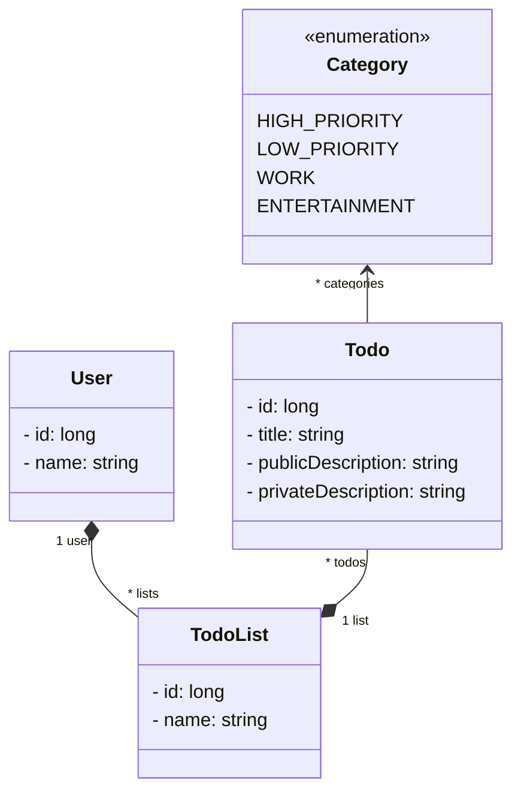

# Préambule

Le sujet est tout neuf et contient certainement des erreurs. N'hésitez pas à me les indiquer. **Vous devez terminer le TP précédent avant chaque nouvelle séance**.

N'hésitez pas à nous demander des explications sur des concepts Java/POO que vous ne comprenez pas.


# Compétences visées

- Créer un back-end Java avec Spring

- Créer une API REST en Spring

- Marshaller et démarshaller des données de manière adéquate (DTO)

- Tester une API REST de manière manuelle et automatique (JUnit, Postman, curl)

- Mettre en place une authentification

- Se prémunir de certaines attaques informatiques

- Écrire et traiter des requêtes REST en JavaScript


# Sujet

Le sujet des TP concerne la création d'un back-end pour réaliser des opérations CRUD pour des todos.



Les attributs `id` sont les identifiants uniques des objets.


# Prérequis logiciels

- Les vrais sont sous Linux. En ce qui concerne les autres, vous pouvez toujours vous y mettre.

- Vérifier sa version de (Java 17) :
`java -version`

- Vérifier que Maven est installé (Maven 3) : `mvn -v`

- Avoir Swagger editor en local : https://github.com/swagger-api/swagger-editor<br/>
Le plus simple est d'installer docker et de lancer les commandes suivantes (mettre un `sudo` devant chaque commande si demandé) :
```
docker pull swaggerapi/swagger-editor
docker run -d -p 1024:8080 swaggerapi/swagger-editor
```
et dans votre navigateur aller sur la page `http://localhost:1024/`
Si vous n'y arrivez pas vous pouvez utiliser le Swagger Editor en ligne (https://editor.swagger.io) mais vous ne pourrez alors pas executer vos commandes REST (il faudra alors télécharger et utiliser Postman ce qui complique le TP).<br/>
À tout moment vous pouvez retrouver votre instance docker Swagger avec `docker ps -a`. La première colonne affichée vous indique l'ID de l'instance. Vous pouvez la stopper ou la redémarrer (à chaque début de TP) avec `docker start <id>` et `docker stop <id>`


- Avoir IntelliJ ou VisualCode<br/>

- Cloner our télécharger le dépôt du cours : https://github.com/arnobl/WebEngineering-INSA/<br/>
L'exemple du cours se trouve dans : `rest/springboot2`<br/>
Le projet à utiliser pour le TP se trouve dans : `tp-spring`

- Avec IntelliJ, pour charger le projet du TP : `open` → aller chercher le fichier `pom.xml` du projet → *Open as project* → *Trust Project*. <br/>
Avec VSCode, faites *Ouvrir un dossier*.


# TP 1


## Q1.1

Lancer le back-end en allant dans `Application.java` et en lançant le `main`.

- Sur `http://localhost:1024`, supprimer le contenu afficher et ajouter simplement :
```yaml
openapi: 3.0.3
info:
  title: TP Web INSA Rennes
  description: |-
    Intro au dev d'un back-end REST en Java avec Spring et OpenAPI
  version: 1.0.0
servers:
  - url: http://localhost:8080/api/v1

tags: # Some annotations used to document the route descriptions (optional)
  - name: todo
    description: Les todos
paths:
    /todo/hello:
        get:
            tags:
                - todo
            responses:
              '200':
                description: c'est bon
```

- Exécutez cette commande REST avec `Try it out` -> `Execute`.

- Cette route est déjà codée dans le contrôleur REST `TodoControllerV1` (package `web.controller`). Regardez cette classe.

## Q1.2

- Dans votre navigateur entrez l'URL `http://localhost:8080/api/v1/todo/hello`<br/>
Pourquoi la barre d'adresse de votre navigateur sait-elle gérer une requête REST GET? Est-elle aussi capable de gérer un POST ?


- Affichez la console de développement de votre navigateur. Allez dans l'onglet réseau et rafraîchissez la page. Vous devriez pouvoir observer la requête et ses détails.


## Q1.3 Get OpenAPI

- Dans votre Swagger Editor, ajouter dans le contrôleur `todo` (tag `todo`) une route REST `todo` (`GET`) qui retourna au format JSON une instance de la classe `Todo`. Inspirez vous de l'exemple OpenAPI du cours : https://github.com/arnobl/WebEngineering-INSA/blob/master/rest/openapi.yaml
Notamment, vous aurez besoin de définir et d'utiliser le schéma de l'objet retourné (le `Todo`). En grand prince je vous le donne pour cette fois :
```yaml
components:
  schemas:
    Todo:
      type: object
      properties:
        id:
          type: integer
          format: int64
          example: 10
        title:
          type: string
        description:
          type: string
        categories:
          type: array
          items:
            type: string
```
Tester que la commande ne fonctionne pas.

## Q1.4 Get Spring

- Codez cette requête dans votre contrôleur REST (il faudra redémarrer le back-end). L'instance retournée sera `new Todo(1, "A title", "private desc", "public desc", List.of(Category.ENTERTAINMENT, Category.WORK))`
- Tester à nouveau dans Swagger Editor. Vous pouvez voir que le format du JSON reçu ne correspond pas à celui attendu (celui défini dans Swagger Editor). Nous verrons cela plus tard avec les DTO.
- Tester dans le navigateur


## Q1.5 Post v1

- Créer une route REST `POST` `todo` (dans Swagger Editor puis dans votre projet Spring) qui recevra un objet `Todo` (en JSON, `consumes`) avec les données que vous voulez. Le type de retour de la route sera `void` (code 200).
- La route affichera pour l'instant juste cet objet (`System.out.println(...)`).
**Attention :** la sortie de `println` sera visible dans la console d'IntelliJ (et non dans votre navigateur).
- Tester avec Swagger Editor


## Terminer le TP pour la séance d'après

**Et sauvegarder votre openAPI de Swagger Editor !**


# TP 2

## Q2.1 Post v2

Dans les questions précédentes, nous ne sauvegardions pas les todos crée par la commande `post`, et ne gérions pas l'identifiant unique.

- Dans la contrôleur REST, ajoutez un attribut `cpt` (type `integer`) qui sera incrémenté à chaque nouveau todo et donné alors comme identifiant au nouveaux todos. Modifiez la route `POST` en conséquence. Cette pratique n'est pas propre du tout. Nous verrons plus tard comment faire cela de manière correct.

- Étant donné que les objets todo à stocker ont une clé unique et que nous voudrions certainement chercher en fonction de cet id, quel serait la structure de donnée adequate à utiliser ici ? Toujours dans le contrôleur, ajoutez un attribut `todos` dont le type sera la structure identifiée.
La route `POST` ajoutera le todo crée dans cette structure et retourna le todo crée. Modifier le Swagger Editor en conséquence. Modifiez le `println` pour qu'il affiche la liste.


Donc, dans cette structure tous les todos doivent avoir un id différent.

## Q2.2 Delete

- Ajouter (dans Swagger Editor et votre code Spring) une route `DELETE` `todo/{id}` qui supprimera le todo dont l'id est celui donné en paramètre de l'URI. Cette route devra alors chercher dans la structure le todo dont l'id est égal à celui du todo passé en paramètre. Si la recherche échoue, alors retourner un code `400` (cf l'exemple *openapi.yaml*). Si elle réussie, vous supprimerez l'objet de la liste du contrôleur.

- Testez avec Swagger Editor.


## Q2.3 Put

- Le `Put` remplace un objet par un autre. C'est une manière de modifier complètement un objet.
Ajoutez une route (dans Swagger Editor et votre code Spring) `PUT` `todo` qui fera cette opération sur un todo. Pour cela vous pouvez copier-coller-adapter la route `POST` car assez proche.

- Testez avec Swagger Editor.


## Q2.3 Patch pas terrible

- Ajoutez une route `PATCH` `bof/todo` (bof, car cette version n'est pas terrible) qui modifiera un todo. Pour cela copier-coller-modifier la route `POST` `todo` car cette première version du patch est assez similaire. Cette route devra alors chercher dans la liste le todo dont l'id est égal à celui du todo passé en paramètre. Si la recherche échoue, alors retourner un code `400` (cf l'exemple *openapi.yaml*). Si elle réussie, alors vous utiliserez les setters de `Todo`, par exemple :
```java
  if(todo.getPublicDescription() != null) {
    todoFound.setPublicDescription(todo.getPublicDescription());
  }
  //etc.
```

Cette manière de faire le patch souffre de plusieurs défauts importants. Lesquels selon vous ?
Lecture intéressante : https://stackoverflow.com/a/19111046/9649530


## Q2.4 Patch un peu mieux

TODO


## Bilan TP2

Nous avons vu les bases pour coder des routes REST réalisant des opérations CRUD sur un type d'objets (le `Todo`).

Pour l'instant le code de notre back-end a plusieurs défauts majeurs :
- Stockage des objets dans le contrôleur. Ca n'est pas une bonne pratique car comment partager les données entre plusieurs contrôleurs ? Et est-ce le rôle d'un contrôleur de stocker ? Nous utiliserons plus tard un *service*.
- Gestion à la main de l'unicité des objets et stockage peu efficaces des données. Nous utiliserons une base de données et son lien avec le back-end (JPA) plus tard.
- Nous (de-)marshallons directement les objets `Todo` alors que nous voulons que quelques attributs dans certains cas. Nous utiliserons des DTO plus tard.
- Pas de test unitaire (TU) écrit pour l'instant.
- Pas de sécurité : tout le monde pour faire du CRUD sur les objets todo.


## Terminer le TP pour la séance d'après

**Et sauvegarder votre openAPI de Swagger Editor !**


# TP3

## Q3.1 contrôleur V2

- Copiez-collez le contrôleur `TodoControllerV1.java` pour avoir un `TodoControllerV2.java` dont le `RequestMapping` indique `api/v2/todo`.
Changez également l'adresse du serveur dans Swagger Editor en conséquence.
Nous travaillerons sur ce nouveau contrôleur avec cette nouvelle URI.


## Q3.2 Service

- Créez un service `TodoListService` et ajoutez un attribut de ce type dans votre nouveau contrôleur avec `@autowired`. Que fait cette annotation ?

- Déplacez les attributs `cpt` et `todos` dans ce service. Cela va vous demandez de modifiez la plupart des routes de votre contrôleur délègue au service tout la logique CRUD des opérations.
Votre service devrait donc avoir les méthodes suivantes :
```java
	public Todo addTodo(final Todo todo) {
	}
  // true if newTodo corresponds to an existing todo
	public boolean replaceTodo(final Todo newTodo) {
	}
// true if id corresponds to an existing todo
	public boolean removeTodo(final int id) {
	}


	public Todo modifyTodo(final Todo partialTodo) {
	}


	private Todo findTodo(final int id) {
  }
```

- Que se passe-t-il si je mets un attribut `@autowired TodoListService...` dans un autre contrôleur ?


Quel sont les avantages d'un service par rapport à nos 2 TP précédents ?
Nous creuserons en 4INFO ce concept d'injection de dépendances (le `@autowired`).


## Q3.3 Repository

Coder un service comme nous l'avons fait dans la question précédente est un peu laborieux (gestion à la main du `cpt`, structure de stockage) : les opérations CRUD sur un objet, c'est du grand classique et Spring fournit un mécanisme pour simplifier cela : les `repository`.
Les `repository` sont injectables tout comme les services. La différence est que ces premiers ont pour but de stocker des données et faciliter leur accès. Les services offrent des méthodes pour réaliser des opérations, des calculs.

- Dans le package `web.service` créez un repository CRUD pour les todo :

```java
@Repository
public interface TodoCrudRepository extends CrudRepository<Todo, Long> {
}
```
Pour rappel, le générique `Long` correspond au type de la clé primaire de `Todo` (l'attribut `id`).

- Dans `TodoService`, mettez en commentaire les attributs `cpt` et `todos` et ajoutez à la place votre nouveau repository :
```java
@Autowired
private TodoCrudRepository repository;
```

- Modifiez le code du service pour qu'il utilise désormais le repository pour stocker les objets `todo`. Vous noterez que la méthode `save` du repository ne demande pas l'id unique de l'objet. Pourquoi ? (il manque quelque chose dans la classe `Todo` que nous allons ajouter).


- Ajoutez les annotations nécessaires dans la classe `Todo` pour pallier le problème précédent.


- Testez votre nouveau contrôleur avec Swagger Editor.


## Bilan TP3

Nous avons vu comment mieux gérer les données manipulées dans un back-end à l'aide des services et des repositories.


Cependant, le notre back-end a encore des défauts :
- Nous utilisons un repository CRUD et non une véritable base de données, ce qui nous empêche d'écrire des requêtes SQL.
- Nous (de-)marshallons directement les objets `Todo` alors que nous voulons que quelques attributs dans certains cas. Nous utiliserons des DTO plus tard.
- Pas de test unitaire (TU) écrit pour l'instant.
- Pas de sécurité : tout le monde pour faire du CRUD sur les objets todo.


# TP4

## Q4.1 Retour des routes REST

Étant donné le code ci-dessous, qu'est-ce qui est retourné au client qui a envoyé la requête REST ? Un objet Todo ?

```java
	@GetMapping(path = "todo", produces = MediaType.APPLICATION_JSON_VALUE)
	public Todo todo() {
		return new Todo(1, "A title", "private desc", "public desc", List.of(Category.ENTERTAINMENT, Category.WORK));
	}
```

Et maintenant avec cette méthode qui retourne void ?

```java
	@DeleteMapping(path = "todo/{id}")
	public void deleteTodo(@PathVariable("id") final int id) {
		if(!todoListService.removeTodo(id)) {
			throw new ResponseStatusException(HttpStatus.BAD_REQUEST, "Not possible");
		}
	}
```

## Q4.2

Du coup, quelle différence avec le code suivant ? Que permet le code suivant ?


```java
@PutMapping(path = "user", consumes = MediaType.APPLICATION_JSON_VALUE)
public ResponseEntity<String> replaceUser(@RequestBody final User patchedUser) {
  if(patchedUser.getId().equals(dataService.getUser().getId())) {
    dataService.setUser(patchedUser);
    return ResponseEntity.ok().build();
  }
  throw new ResponseStatusException(HttpStatus.BAD_REQUEST, "The ID is not the same");
}
```


## Q4.3 Les exceptions

Toujours avec le code suivant, qu'est-ce qui est retourné au client lorsqu'une exception est levée ?

```java
	@DeleteMapping(path = "todo/{id}")
	public void deleteTodo(@PathVariable("id") final int id) {
		if(!todoListService.removeTodo(id)) {
			throw new ResponseStatusException(HttpStatus.BAD_REQUEST, "Not possible");
		}
	}
```

## Q4.4 Marshalling avec héritage

La classe `SpecificTodo` est une sous-classe de `Todo`.
Modifiez la route `GET` `todo/todo` pour quelle retourne un objet `SpecificTodo`. Relancez le serveur et testez cette route. Utilisez le résultat retourné pour l'envoyer via la route `POST`. Pourquoi cette dernière ne crée finalement pas un `SpecificTodo` mais un `Todo` ?

Ajoutez les annotations nécessaires pour que cela fonctionne. Cf slide TODO. Il vous faudra aussi ajouter l'annotation `@Entity`.


## Q4.5

Créez un nouveau contrôleur (URI `api/v2/todolist`), un nouveau service et un nouveau repository pour les `TodoList`.

## Q4.6

Ajoutez dans Swagger Editor et dans votre nouveau contrôleur les routes REST suivantes :
- une route pour ajouter une todolist vide. Vous devrez ajouter des annotations à `TodoList` à l'instar de `Todo`. Vous devrez également ajouter des annotations JPA pour identifier les clés étrangères de TodoList et Todo : puisque que TodoList à une liste de Todo, dans la base de données il faut expliciter comment cette référence Java va se transformer en schéma relationnel. Regardez les annotations `@OneToMany` et `@ManyToOne` slides TODO. Sans ces annotations, le back-end crashera et vous expliquant qu'il ne sait pas gérer dans la base de données la relation entre ces deux classes.


## Terminer le TP pour la séance d'après

**Et sauvegarder votre openAPI de Swagger Editor !**


# TP5


## 5.1 DTO

La route pour ajouter une todolist vide n'est pas optimale : pourquoi envoyer un objet todolist alors que nous n'avons besoin que de son nom ?
Plusieurs solutions : mettre le nom dans l'URI de la requête ou embarquer un DTO contenant que le nom dans le body de la requête. Nous allons utiliser cette dernière solution.

- Créez un DTO `namedDTO` contenant juste un attribut correspond à un nom. Pensez à l'annotation `@Data` de *lombok* pour générer les getters et setters.

- Ajoutez ce DTO dans la définition de votre Swagger Editor et modifiez la route concernée.


## 5.2

- Ajoutez une route pour ajouter un todo à une todo list (un todo pour être dans plusieurs list pour l'instant). Attention, vous aurez donc besoin de l'id du todo à ajouter, et l'id de la todo list concernée. Donc votre `TodoListService` aura les deux repositories.


## 5.3 Patch Todo

Nous allons modifier la requête patch todo pour la rendre de meilleure qualité.
- Inspirez vous du slide TODO pour modifier la requête et le service pour patch correctement le todo.
- Modifiez le Swagger Editor et testez


## 5.4 Query

- Ajoutez une query dans le repository des Todo pour retourner la liste des Todo dont le titre contient le texte donné en paramètre (cf la partie Query dans le cours).

- Ajoutez la requête REST associée dans le contrôleur Todo v2 et testez avec Swagger Editor


# TP6 Test

Le sujet de ce TP est simple.
Développer une suite de tests qui teste la dernière version de votre contrôleur, votre service, et repository avec une couverture de branche de 100%.
En test unitaire (TU) nous testons chaque classe séparement, donc le service puis le contrôleur (le repository n'a pas de code étant géré par Spring).

- Complétez la classe de tests `TestTodoService`

- Complétez la classe de tests `TestTodoControllerV2`


# TP7 Test

À l'instar du TP6, faites de même pour `TodoList`. Il vous faudra créer les classes de tests.


# TP8 Sécurité


------------------------------

## Q1.9

- Ajouter une requête `POST todolist/{userName}`. Cette requête doit avoir un paramètre `userName` correspondant au nom de l'utilisateur à qui il faut ajouter la todo list (embarquée dans le body de la requête).<br/>
Cela vous demandera de coder une méthode `findUser(String userName)` dans le contrôleur pour chercher un utilisateur dans la liste `users` en fonction d'un nom. Cette méthode retournera `null` si aucun utilisateur ne correspond au nom.

- Tester avec Postman


## Q1.10


- Modifier la requête `POST todo` pour que son URI soit désormais `todo/{userName}/{todolistName}`.
En effet, l'ajout d'un todo requière le nom de la todo list ainsi que le nom de l'utilisateur.
Modifier le code de cette requête pour qu'elle ajoute le todo envoyé dans la todo list de destination (ne rien faire si pas possible).<br/>
Cela vous demandera de coder :
une méthode `findTodoList(String todolistName)` dans la classe `User`, pour trouver la todo list visée ;
une méthode `findTodo(String todoTitle)` dans la classe `TodoList`, pour trouver le todo visé dans la todo list ;
une méthode `findTodo(String userName, String todolistName, String todoName)` dans le contrôleur, pour trouver le todo visé.


- Tester avec Postman

# Exercice 2


## Q2.1

- Créer une classe de tests `TestTodoList` (dans `src/test/java/web/model`) pour y tester la méthode `findTodo`.

- Créer une classe de tests `TestUser` (dans `src/test/java/web/model`) pour y tester la méthode `findTodoList`.


## Q2.2

- Écrire un test JUnit qui testera la route `GET todo` (les données et le code HTTP retournés).
Pour cela créer une classe de test `TestTodoV1` dans `src/test/java/web/controller`.
Cf. le cours pour comment tester avec Spring (vers la page 67).
Pour l'instant, ne pas pré-câbler (annotation `@Autowired`) de service `TodoService`, mais ne pas oublier de mettre cette annotation sur l'attribut `MockMvc`.
Du coup, ne pas instancier ces attributs : c'est Spring qui s'en charge.
Cette annotation demande à Spring d'injecter une valeur dans l'attribut :
placée sur `TodoService`, cela permettra plus tard de partager le même `TodoService` entre votre contrôleur et votre classe de tests.
Raccourci clavier pour importer une méthode statique (telle que `get()`) : curseur positionné sur la méthode → `alt+entrée` → *import static method* → trouver la bonne méthode. Pour le `get` de Spring, le package à importer est :<br/>
 `import static org.springframework.test.web.servlet.request.MockMvcRequestBuilders.get;`

- Penser à bien tester la structure JSON retournée en utilisant le code donné dans le cours.

- La sécurité est cruciale dans une application Web. Le test que vous venez d'écrire peu encore être amélioré : imaginons que vous rajoutiez un nouvel attribut dans la classe `Todo`, hors ce nouvel attribut est une information sensible que vous ne voulez pas divulguer. Problème : votre test passe toujours malgré cet ajout. Une technique consiste à vérifier le nombre d'attributs dans la structure retournée :<br/>
`.andExpect(jsonPath("$.*", hasSize(4)))`<br/>
Ainsi, lors de l'ajout d'un nouvel attribut, le test ne passera plus et il faudra soit le mettre à jour, soit modifier le code de Todo pour qu'il ne marshalle pas cet attribut. On verra plus tard que l'autre solution plus propre consiste à utiliser des DTO.


## Q2.3

- Tester (JUnit) que l'ajout (`POST todo`) ne crash pas : que le code de retour est bien `OK` (exemple vers page 73). Noter qu'en Java 17 vous pouvez écrire un *text block* :
```java
    .content("""
{
    "title": "title2",
    "privateDescription": "foo",
    "publicDescription": "bar",
    "categories": ["ENTERTAINMENT"]
}
	"""))
```
Un bloc de triple quote `""" """` permet de mettre ce que l'on veut à l'intérieur (en l'occurrence des quotes). Le formatage est également respecté.


- De manière générale, comment tester qu'un ajout a bien fonctionné (on le fera plus tard) ?


# Exercice 3

Vous avez réalisé une version *v1* de l'API REST (avec peu de tests unitaires, mais on fera mieux par la suite).

Cette *v1* souffre d'un défaut majeur : toutes les données sont contenues dans les contrôleurs REST de Spring (les attributs de la classe `TodoV1`). Le but de cet exercice est de réaliser une *v2* qui résoudra ce problème.

## Q3.1

- Pourquoi contenir les données dans les contrôleurs REST est une très mauvaise pratique ?


## Q3.2

- Créer un nouveau contrôleur REST Spring `TodoV2` avec l'URI `'api/insa/v2/todo'` (Cf. le cours). Y copier-coller le contenu de `TodoV1`.

## Q3.3

- Créer un service `TodoService` (cf. à partir de la page 64 dans le cours).


- Y mettre les données (la liste de `user`) utilisées par `TodoV2` **ainsi que les méthodes `findUser` et `findTodo`**.

- `TodoV2` devra avoir un attribut du type de ce service et qui sera instancier, pour l'instant, dans le constructeur du contrôleur. Les routes devront alors passer par ce service pour accéder aux données et aux méthodes `findUser` et `findTodo`.


## Q3.4

En fait, c'est également une très mauvaise pratique d'instancier un service directement dans un contrôleur. Un service est un objet créé et géré par le serveur (l'application Spring) et fourni aux différents contrôleurs qui le demandent. C'est le principe de l'injection de dépendances que nous verrons en 4INFO. Le but est de pouvoir partager un même service au travers de différents contrôleurs.

- Faire comme dans le slide 67 : le service est un paramètre du constructeur du contrôleur et non instancié dans celui-ci.

- Pour rappel, qui instancie les contrôleurs et les services, etc. ?


## Q3.5

- Créer une classe de tests `TestTodoV2` et y copier-coller le contenu de `TestTodoV1`. Modifier ensuite la classe de tests pour y ajouter un attribut :
```java
@Autowired
private TodoService todoService;
```

- Compléter vos tests existants pour utiliser ce service afin de vérifier que les requêtes REST ont bien un effet sur les données


## Q3.6

- À ce niveau vous devriez avoir des opérations CRUD pour `User`, `TodoList` et `Todo`.
Si ça n'est pas le cas, compléter votre API REST.
Votre suite de tests doit tester votre API REST avec au moins un test par route REST.


# Exercice 4

Vive le marshalling et l'héritage.
Dans cet exercice, vous allez comprendre comment marshaller des types abstraits, ce qui ne se fait pas naturellement avec Spring (et autres).
Le but est de mieux comprendre le marshalling en Java et la magie qui opère grâce à Spring.


## Q4.1

- Ajouter une classe `SpecificTodo` qui hérite de la classe `Todo`.
Cette nouvelle classe a un attribut `String mySpecificAttr`.

## 4.2

- tester votre route REST `POST todo` en envoyant une instance de `SpecificTodo`.
Que ce passe côté serveur ? Quelle est le type de l'objet marshallé par la route ?


## 4.3

- Ajouter les annotations nécessaires sur `Todo` pour que le marshalling fonctionne correctement avec l'héritage (cf. le cours)

- Tester avec Postman

- Écrire un test unitaire qui poste un `SpecificTodo`.


## Exercice 5

Vous avez réalisé une version *v2* de l'API REST.
En fait cette *v2* n'est pas très réaliste : elle permet d'appliquer des opérations CRUD sur le modèle.
Dans la vraie vie, une API REST doit plus être orientée métier que CRUD :
imaginons que nous fabriquions une véritable application pour Todo,
Cette application aurait des fonctionnalités, telles qu'afficher le nom des todo lists, recherche des todos.
Quelles seraient les différentes routes REST idéales pour ces usages (question rhétorique, cf 5.1) ?
La conception d'une API REST doit plutôt se faire en pensant à l'usage :
comment faciliter la fabrication d'un front-end en fournissant une API REST dédiée


## 5.1

- Proposer une API REST, orientée métier, composée de six routes REST pour afficher (2 routes), rechercher (1 route), éditer (2 routes)
les todos d'un utilisateur.


## 5.2

- Proposer les structures de données idéales pour ces cinq requêtes.
Le but est de réduire au minimum les données envoyées ou reçues par les routes.
Par exemple, un utilisateur peut vouloir la liste de ses todolist, auquel cas la requête REST correspondante
a juste besoin de retourner la liste des noms (et non les objets todolist dans leur intégralité).
Ces structures de données seront nos DTO.


## 5.3

- Créer des classes (ou des `record` Java) pour chacune des structures de données idéales.
https://openjdk.java.net/jeps/395


## 5.4

- Coder un nouveau contrôleur REST qui implémente votre nouvelle API REST en utilisant ces DTO.

- Tester avec Postman (avec Junit si vous êtes en avance).


# Exercice 6

Le but de cet exercice est d'utiliser votre API REST au travers d'un script JavaScript.
Pour cela il vous faudra lancer l'application (votre serveur Spring) que votre script JS interrogera.

## 6.1

- Créer un fichier `.js`
- Y ajouter `console.log('foo');`
- Lancer une ligne de commande `node ./votreScript.js` (`NodeJS` est un interpreteur JavaScript)


## 6.2

- Comprendre https://developer.mozilla.org/en-US/docs/Web/API/XMLHttpRequest/Using_XMLHttpRequest
- Si `XMLHttpRequest` s'utilise de base dans un navigateur, il vous faudra installer une bibliothèque avec *npm* :
Dans le dossier contenant votre script, installer le paquet `npm install xmlhttprequest --save`<br/>
`npm` est le *Node Package Manager*, un outil de Node pour installer des bibliothèques.

## 6.3

- Dans le script, créer au début un objet `XMLHttpRequest`:
```js
const XMLHttpRequest = require("xmlhttprequest").XMLHttpRequest;
```

- Interroger votre back-end en utilisant cet objet `XMLHttpRequest`.


# Exercice 7

Cet exercice vise à mettre en place un système d'authentification des utilisateurs :
un utilisateur ne peut modifier que ses todos.<br/>
Cet exercice va empêcher les contrôleurs précédents de fonctionner.


## 7.1


- Dans la classe `SecurityConfig`, commenter `.antMatchers("/api/**").permitAll()` et ajouter `.antMatchers("/api/public/**").permitAll()`


- Re-exécuter certaines des requêtes REST précédentes. Que se-passe-t-il ?


## 7.2

- Dans la classe `SecurityConfig` ajouter :
```java
	@Bean
	public PasswordEncoder encoder() {
		return new BCryptPasswordEncoder();
	}

	@Bean
	public UserDetailsManager userDetailsManager() {
		return new InMemoryUserDetailsManager();
	}

    @Override
	protected void configure(final AuthenticationManagerBuilder auth) throws Exception {
		auth
			.userDetailsService(userDetailsManager()).passwordEncoder(encoder());
	}
```

Ce code :
choisit l'encodage des mots de passe (*BCrypt*) ;
permettra de stocker en mémoire les utilisateurs du système ;
configure que l'authentification utilisera bien ces deux points précédents.
`UserDetailsManager` n'est pas redondant avec notre classe `User`.
Elle stocke uniquement logins et mots de passe et gère les ouvertures de session.


## 7.3


- Créer deux contrôleurs Spring: `PublicUserControler` et `PrivateUserControler`.
Leur URI doit respectivement contenir `/api/public/` et `/api/private/`.


- Utiliser le code fournit dans les classes `PublicUserController` et `PrivateUserController` du projet exemple (le projet montré en cours).

- Tester ces nouvelles routes REST avec Postman

- Une fois un utilisateur authentifié, est-ce que les anciennes requêtes REST fonctionnent à nouveau ? Pourquoi ?


## 7.4

- Lire le cours à partir du slide 75 et faire en sorte que les requêtes REST fonctionnent bien après authentification
